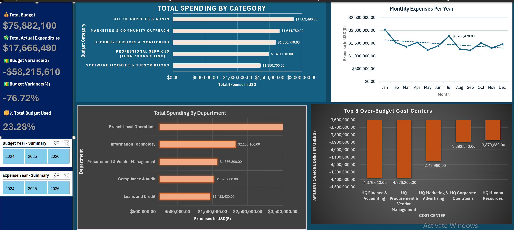
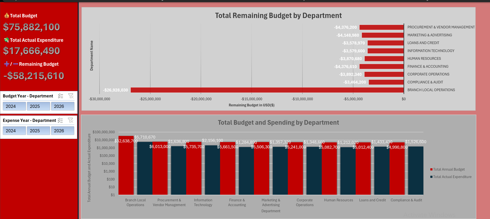
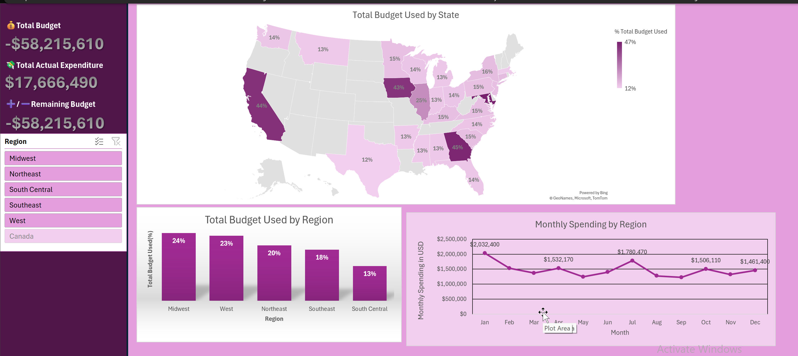
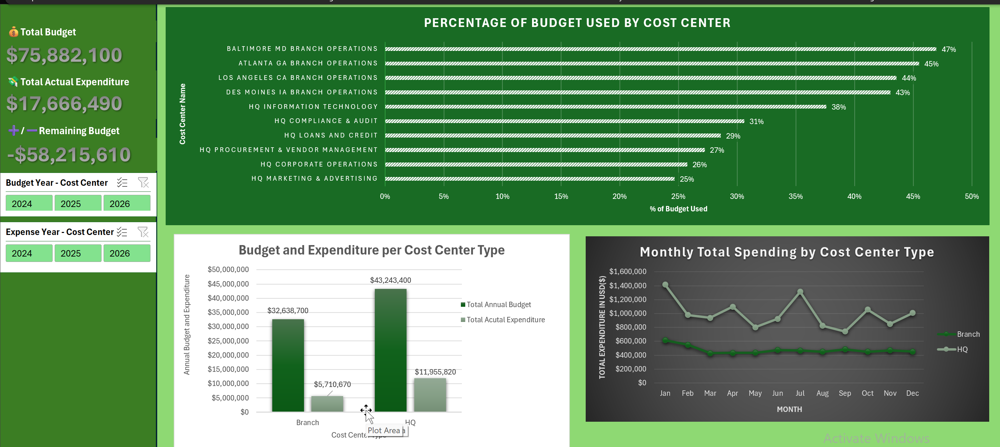
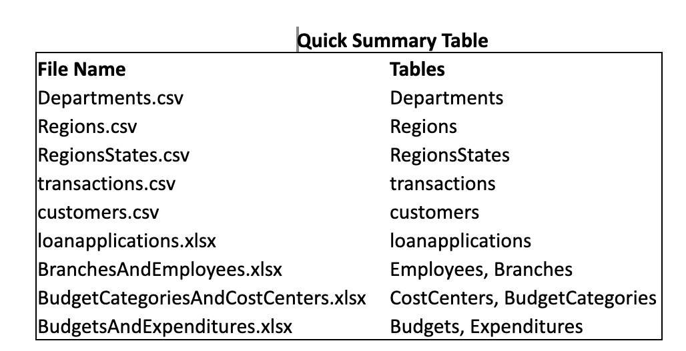

# Banking Financial Performance Analysis


## Overview
This project simulates a real-world financial analytics engagement for a regional banking corporation. The executive leadership team required visibility into branch performance, departmental spending, cost center variance, and overall budget utilization.

I designed and queried a MySQL relational database to explore financial and operational data across 12 interrelated tables. After validating relationships and extracting key metrics using SQL, I connected Excel directly to the database using Power Query to clean, transform, and model the data.

The final deliverable was an executive-ready Excel dashboard highlighting budget vs. actual performance, departmental breakdowns, regional trends, and over-budget cost centers.

## [Reports](https://github.com/pskmays/banking-financial-performance-analysis/tree/main/visuals)

### Executive Overview


### Department Budget vs Expenditure


### Regional Financial Performance


### Cost Center Variance Analysis


## Project Structure

```text
banking_financial_performance/
├── documentation
│   └── Data_Model.png                 # Excel/Power Pivot relationships diagram
├── excel
│   └── Financial_Dashboard.xlsx       # Executive-ready dashboard
├── LICENSE                             # Open source or portfolio license
├── README.md                            # Project description, instructions, overview
├── sql
│   ├── banking_financials_db.sql       # Schema creation & table definitions
│   └── banking_financials_exploration_queries.sql   # SQL queries & insights
├── src
│   └── data
│       ├── Branches.csv
│       ├── BudgetCategories.csv
│       ├── Budgets.csv
│       ├── CostCenters.csv
│       ├── customers.csv
│       ├── Departments.csv
│       ├── Employees.csv
│       ├── Expenditures.csv
│       ├── loanapplications.csv
│       ├── Regions.csv
│       ├── RegionsStates.csv
│       └── transactions.csv            # Raw CSVs or sample/sanitized data
└── visuals
    ├── Cost_Center_B&E_Analysis.png    # Dashboard visual: Cost Centers
    ├── Department_B&E_Analysis.png     # Dashboard visual: Departments
    ├── Regional_B&E_Analysis.png       # Dashboard visual: Regional Analysis
    └── Summary_Dashboard.png           # Overview dashboard screenshot
```


## Dataset
The dataset simulates financial and operational data from a regional banking corporation. It includes 12 relational tables covering departments, branches, budgets, expenditures, cost centers, regions, employees, customers, transactions, and loan applications.

The structured format allows for budget vs. actual analysis, cost center performance evaluation, regional financial comparisons, and overall operational insight.

## Database
To facilitate data management and analysis, a SQL database has been created to store the dataset. SQL provides a robust and efficient way to query and manipulate the data. The database schema has been designed to ensure proper organization and ease of use. The structure of the database enables seamless integration with various data visualization tools.

## Data Processing

The data was loaded into a relational MySQL database and validated for structure and integrity. SQL queries were used to explore table relationships, filter records, create calculated fields, and generate aggregated financial metrics.

The cleaned and structured data were then connected to Excel using Power Query, where additional transformations (data type corrections, formatting, and relationship modeling) were applied to ensure accurate and reliable financial reporting.




## Project includes:

**Overview:** A leadership-focused dashboard summarizing total budget, total actual expenditures, budget variance (amount and %), and overall budget utilization.

**Budget vs. Expenditure Analysis:** Departmental and cost center breakdowns highlighting over-budget areas and spending efficiency.

**Regional Financial Analysis:** Comparisons of financial performance across regions and branches.

**Cost Center Performance:** Identification of the top over-budget cost centers and high-spend vendors.

**Trend Analysis:** Monthly expenditure trends to identify spending patterns over time.
**Data Modeling & Relationships:**Structured relational database design and Excel Data Model relationships to ensure accurate financial reporting.

**Filtering and Interactivity:** PivotTables and slicers enabling dynamic financial analysis and drill-down capabilities.

## Technologies Used
**SQL:** For data extraction, transformation, and loading into the database.

**Database Management System:** MySQL Workbench to host and manage the dataset.

**Programming Languages:**  SQL for data processing and scripting.

**Excel:** Power Query for data cleaning and transformation, Data Model for relationship management, and dashboard development for executive reporting.


**Executive Summary**
A substantial portion of revenue comes from the Northeast region of the U.S., which not only generates the highest revenue but also has the largest customer base among all five regions. Given its significance, marketing strategies should prioritize the Northeast to maximize impact. HQ Procurement Vendor Management ranks first among over-budget cost centers and second in total expenses, indicating both high spending levels and budget variance. I am suggesting the need for closer budget monitoring and expense control.

## Author
- <ins><b>©2026 Kenye Mays. All rights reserved</b></ins>
- <b>[LinkedIn](https://www.linkedin.com/in/kenye-mays/?skipRedirect=true)</b>
- <b>[My Website](https://pskmays.github.io/portfolio/)</b>

## Contact me!

If you have any questions, suggestions, or want to say hello, you can reach out to me at [Kenye Mays](mailto:kenyemays00@gmail.com). I would love to hear from you!
